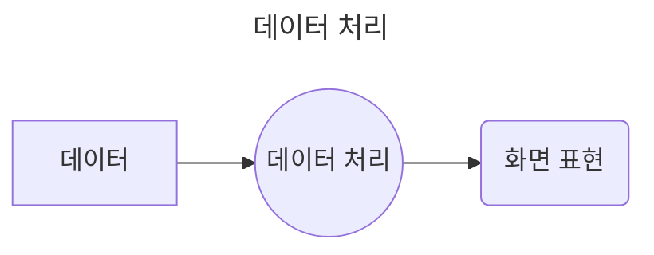
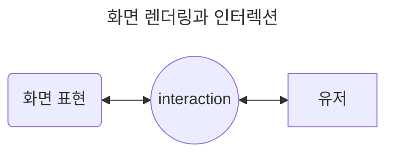
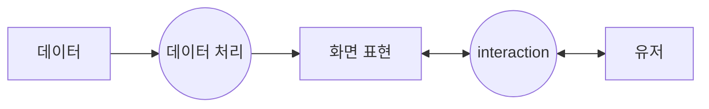

## 제목 : 강의 목표와 커리큘럼

### 유형 : 동영상

---

우리는 왜 **Javascript** 를 공부하려 하는가?

어떤 사람은 검색 창과 같은 **UI** 를 제작하기 위해 배우기도 하며,

어떤 사람은 서버를 만들고 싶은 사람도 존재 할 것이다. (ex - express)

혹은 **App**을 만들고 싶은 사람도 존재 할 것이다. (ex - React Native, flutter, 등)

즉, 다양한 목적을 위해 **Javascript**를 공부하는 사람들이 존재한다는 것이다. 

 

예를 들어, 프론트 영역인 웹 UI를 제작한다고 가정한다.

이 과정에서 검색창을 구현하는 상황으로 간주한다.

그렇다면, 도대체 어느 영역부터 시작해야 하는가?

 

네이버 검색창과 같은 UI를 상상해 보자.

왼쪽의 창은 검색할 단어를 입력할 영역이 존재하며, 오른쪽에는 검색 버튼이 존재한다.

이에 대한 **관심사** 를 하나로 뭉뚱그려 표현해 보자.

이는, **"버튼을 클릭해서 검색한다."** 와 같다.

위의 목적을 한번 더 쪼개보자.

1. 알고 있는 키워드를 넣어 - User Input
2. 검색 기능(feature) 을 활용하여
3. 원하는 정보(data) 를 얻는다.

이 과정에서 알아야 하는 것은,

**데이터**, **화면 표현**, **유저**(요구사항 등) 이 존재한다. 

 

먼저, **데이터** 영역에서 **화면 표현**을 하기 위해 **데이터 가공** 을 하는 것을 보자.

### 데이터 가공

* 데이터를 담는 변수
* 데이터의 형태
* 가공을 위한 함수를 생성
  * **flow control**, 빌트인 객체
* 실행을 위한,
  * 엔진
  * 언어가 갖고 있는 매커니즘
  * Error 처리

"데이터" 영역에서 "데이터 처리" 후, "화면 표현" 으로 이어지는 그래프는 다음과 같다.

 

그 다음으로, **화면 표현** 영역에서 **유저 인터랙션** 을 하는 과정을 보자.

### 화면 렌더링과 인터렉션

* 브라우저에서
* 파일이 **Load** 되고
* 실행 

 

* 데이터를 조회하고 : **비동기**
* 보여주는 과정 : **Rendering**(렌더링)
* 인터렉션이 되도록 세팅 : **Event**

"화면 표현" 영역에서 "유저" 와 상호작용하는 그래프는 다음과 같다.

 

그렇다면, 위의 내용을 간략화 할 수 있는 그래프를 그려보겠다.

 

## Conclusion - 결론

그렇다면 우리는 **Javascript** 를 배우는 걸까?

1. 유저의 **Pain Point** 를 해결하기 위해, **서비스를 만든다**
2. **서비스** 를 만들기 위해, **웹 개발을 배운다**
3. **웹** 을 개발하기 위해, **Javascript**를 배운다.

