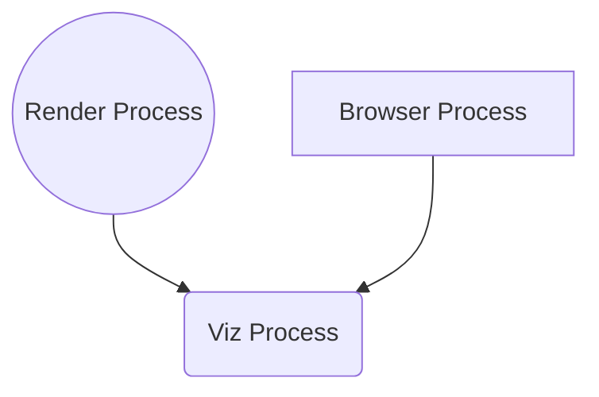

## 제목 : 브라우저와 개발자도구

### 유형 : 동영상

---

## Browser

**Chrome**, **Safari**, **Opera**, **Edge** 와 같은 유명한 브라우저들이 존재하는데,

각각 브라우저마다 사용하는 **Javascript** 엔진이 다르며, 지원하는 스펙이 다르다.

본 수업은 **Chrome** 을 사용한다.

 

브라우저에서 다양한 파일을 로드할 수 있지만, 시각적으로 확인하기 위해 `HTML` 파일을 먼저 로드한다.

브라우저에서 시각 요소를 확인하기 위해서, HTML 파일을 불러오며,

해당 HTML 파일에서 다른 파일을 불러 올 수 있도록 작성한다. : **Javascript**, **CSS**, 등등 

 

그리고, VSCode 로 작업 할 디렉토리를 생성한 후, 오픈한다.

