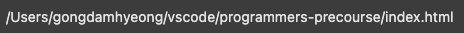
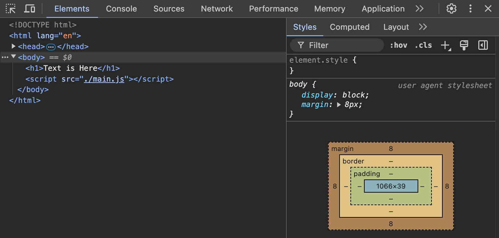
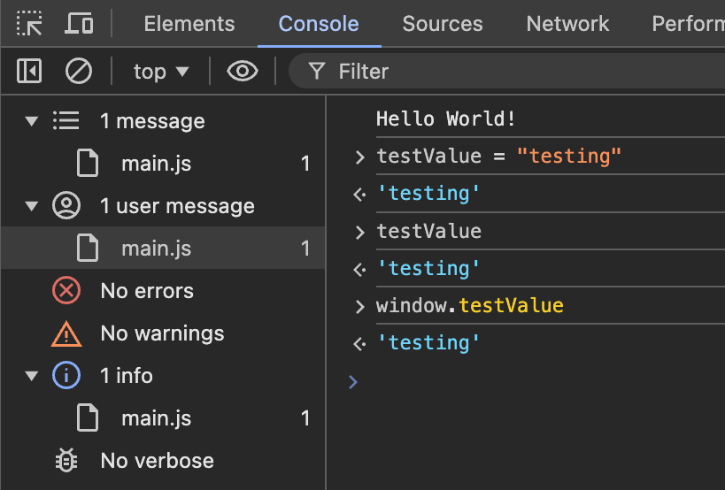
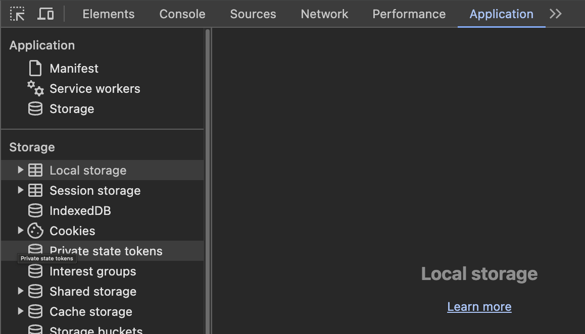
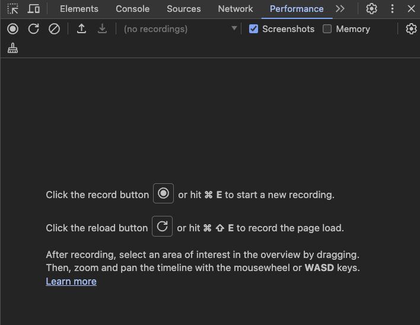

## 제목 : 브라우저와 개발자도구

### 유형 : 동영상

---

## Browser

**Chrome**, **Safari**, **Opera**, **Edge** 와 같은 유명한 브라우저들이 존재하는데,

각각 브라우저마다 사용하는 **Javascript** 엔진이 다르며, 지원하는 스펙이 다르다.

본 수업은 **Chrome** 을 사용한다.

<br/>

브라우저에서 다양한 파일을 로드할 수 있지만, 시각적으로 확인하기 위해 `HTML` 파일을 먼저 로드한다.

브라우저에서 시각 요소를 확인하기 위해서, HTML 파일을 불러오며,

해당 HTML 파일에서 다른 파일을 불러 올 수 있도록 작성한다. : **Javascript**, **CSS**, 등등 


<br/>

그리고, VSCode 로 작업 할 디렉토리를 생성한 후, 오픈한다.


VSCode에 이러한 HTML 코드를 바로 생성할 수 있는 스니펫이 있는데,

`!` 를 `index.html` 에 넣은 후, 직후 **tab** 키를 누르면 된다.

이러한 `index.html` 을 어디서 확인 할 수 있을까?

이는 왼쪽 파일 탭의 `index.html` 오른쪽 마우스 누르기 후, 경로를 복사하거나,

`index.html` 을 누른 후, `OPT + CMD + c` 단축키를 사용하면, 해당 파일의 **절대 경로** 가 복사된다.

이를 브라우저의 주소창에 입력하면 해당 HTML 파일이 등장한다.



해당 주소를 들어가서 `OPT + CMD + i` 단축키를 사용한다면, 개발자 도구를 곧바로 볼 수 있다.

`OPT + CMD + j` 단축키로 개발자 콘솔에 바로 들어갈 수도 있다.


<br/>

## Javascript 적용해보기

바로 직전 세션에서 **HTML** 파일로 **Javascript** 파일을 불러 올 수 있다고 했다.

이를 구현하기 위해, VSCode 에디터에서 `index.html` 과 동일한 디렉토리에 `main.js` 파일을 생성한다.

`index.html` 에서 성공적으로 `main.js` 파일을 불러오는지 확인하기 위해, 간단한 **JS** 코드를 작성한다.

```javascript
console.log("Hello World!");
```

<br/>

**HTML** 내부에서 **JS** 문서를 불러오기 위해서, 특별한 태그가 존재한다.

바로 `<script>` 태그이다.

**HTML** 내부에 `<script src="./main.js></script>` 를 선언하여 불러오자.

변경된 **HTML** 파일인 `index.html` 은 이와 같다.

```html
<!DOCTYPE html>
<html lang="en">
<head>
    <meta charset="UTF-8">
    <meta name="viewport" content="width=device-width, initial-scale=1.0">
    <title>Document</title>
</head>
<body>
    <h1>Text is Here</h1>
    <script src="./main.js"></script>
</body>
</html>
```

`<head>` 태그가 아닌, `<body>` 태그 내부에 선언함으로서 우선순위가 좀 밀리긴 하지만, 

우리가 확인하려는 것은 **JS** 와의 성공적인 연동이기 때문에, 이렇게 작성해보자.

그리고 새로고침하여 이를 확인한다.


개발자 콘솔에 `Hello World!` 가 찍힌 걸 보면서, 성공적인 연동을 확인할 수 있다.

<br/>

## 개발자 도구의 종류

* Elements
* Console
* Sources
* Network
* Performance
* Memory
* Application
* Security
* 등등

브라우저에는 개발자를 도와주는 여러가지 도구들이 존재한다.

**Elements** 는 로드된 파일의 소스를 볼 수 있다.

**Console** 에서는 **JS** 코드를 실행시킬 수 있으며,

**Sources** 에서는 현재 브라우저에서 로드된 모든 소스파일들을 확인 할 수 있다.

**Network** 에서는 네트워크 통신이 일어났을 때, 네트워크 통신 **log** 를 볼 수 있다.

**Performance** 에서는 웹의 성능을 확인합

**Application** 에서는 브라우저의 저장 기능을 확인 할 수 있다.

나머지 탭에서도, 의미와 비슷하게 개발자를 돕는 기능을 포함하고 있다.

<br/>

## 실습



HTML 파일인 `index.html` 이 로드됨에 따라, **Elements** 탭에서 소스를 확인 할 수 있다.

<br/>



위의 예시는, 우리가 직접 만들었던 `main.js` 의 기능의 실행 뿐만 아니라,

개발자 도구의 **Console** 도구로 추가적인 **Javascript** 변수 및 함수를 생성하여 이를 테스팅 할 수 있다는 것을 보여준다.

그렇다면, 이러한 의문이 들 수도 있다.

`testValue` 변수를 선언 한 뒤,

**왜 `window` 객체에서 `testValue` 를 참조하는 것이 가능한가?**

일단, 브라우저에서 최상위 객체는 `window` 라는 것을 참조해야 한다.

단순히 `var`, `let`, `const` 중 하나를 선택하여 선언하는 것이 아니라,

변수명과 값을 입력했을 때, 최상위 객체인 `window`에 속하냐 아니냐가 결정되는 것이다.

`let`, `const` 로 새로이 선언된 변수는 `window` 객체의 속성에 포함되지 않지만,

`var` 은 디폴트로 `window` 객체 속성에 포함되는 것을 볼 수 있다.

따라서, 콘솔에 `test = "test"` 라는 문장을 단순히 입력한다면, `var test = "test"` 와 동일시되어

`window` 객체에 포함되는 것을 볼 수 있다.

<br/>



어플리케이션 탭에서 주목해야 할 것은,

`storage` 가 붙은 저장소, 그리고 `Cookies` 이다.

어플리케이션 자체에서 최적화를 위한 저장소로 쓰이거나,

보안 웹 사이트에 접근하기 위한 **key** 를 저장하는 데 사용되기도 한다.

<br/>



퍼포먼스 탭은 엘리먼트들이 로딩되는 것을 **녹화** 하듯이,

각 구성 요소들의 등장 시간, 그리고 소요 시간을 기록하여,

어떤 구성 요소(엘리먼트) 가 최적화가 필요한 지 알 수 있게 해 줍니다.


