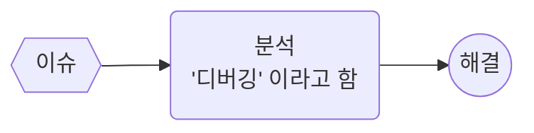

## 제목 : 브라우저와 디버깅

### 유형 : 동영상

---

## Issue - 이슈 

개발을 하다보면, **수 많은 이슈** 를 만나게 된다.

여기서 **이슈(Issue)** 란, 개발 중에 발생한 예기치 않은 상황을 의미한다.

개발자가 이를 해결하는 프로세스는,

 

## Debugging - 디버깅

**디버깅** 이란,

개발 단계 중에 발생하는 시스템의 **논리적인 오류**나 **비정상적인 연산** 을 찾아내고,

그 **원인을 밝히고 수정하는 작업 과정**을 뜻한다. 

 

### 디버깅 방법

**코드 내에 `log` 함수 심기**

> `console.log` : 개발자 콘솔 창에 텍스트 형식의 로그 남기기
> `console.dir` : 개발자 콘솔 창에 객체 형식으로 펼칠 수 있게 보여준다.
> ...

 

**개발자 도구** 의 **Source** 탭을 활용하기 

> 브라우저에서 제공하는 자바스크립트 브레이킹 포인트를 이용하여 특정 위치에서 멈추기.  
> **브레이킹 포인트** : 해당 시점에서 가지고 있는 변수를 확인하거나, 특정 상황 자체를 해석하기 위해 사용됨.

