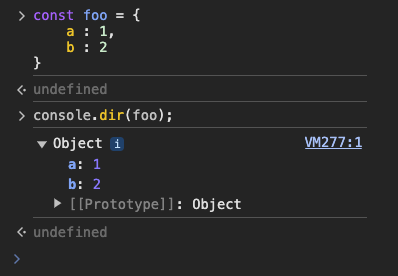
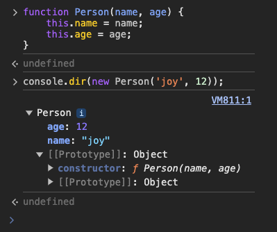
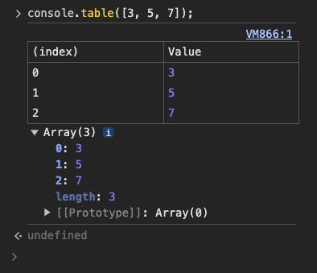
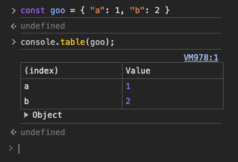

## 제목 : 브라우저와 디버깅 - console

### 유형 : 문서

---

## console.log 

* 입력한 값을 콘솔에 한줄씩 출력한다.
* 코드의 다양한 위치에서 콘솔을 출력 할 경우, 변수 확인에 어려움이 있으므로, <br/> 아래와 같이 작성하는 것을 추천한다.

```javascript
const TEMP = "programmers";

console.log("TEMP >>> ", TEMP);
```

<br/>

이거는 처음 보는 신기한 기능이었는데,

**VSCode Snippet** 을 미리 설정하여 단축어로 활용하는 방법도 존재한다.

**각기 다른 경로일듯**

`~/Library/Application_Support/Code/User/snippets/javascript.json`

```json
{
  "Console log" : {
    "prefix": "clg",
    "body" : ["console.log('$1 >>>', $1)"],
    "description" : "콘솔 로그 tag"
  }
}
```

**Javascript** 코드 문서에,

`clg` 를 입력하면, `Console log` 라는 설명과 함께 **tab** 추천목록에 뜬다.

그대로 **tab** 을 누르면, 

`console.log('| >>>', |)` 이런 식으로 뜨는데,

여기서 `|` 로 표시해둔 곳은, 동시에 입력이 되도록 지원한다.

단축 방법으로서 새로운 방식을 알게 됨.

<br/>

## console.dir

* 주입된 값의 모든 속성을 확인 할 때 사용한다.

예를 들어, **객체**를 출력하려 한다고 가정한다.

먼저, `foo` 라는 객체에 `a`, `b` 를 주입하여 출력 해 보자.



이처럼, `foo` 라는 객체가 가지고 있는 `a` 와 `b` 를 출력하며, 애초에 `Object` 유형임을 알려 준다.

<br/>

그 다음으로, **생성자 함수** 를 출력한다고 가정한다.



`console.dir()` 메서드 내부에 선언된 생성자 선언의 결과를 출력하는 결과를 볼 수 있다.

<br/>

## console.table

* 표 형식의 데이터를 **테이블** 로 표현한다.
* 색인과 값을 테이블 형태로 표현하기 때문에, <br/> 컬렉션 데이터를 확인하는 용도로 적합하다.

<br/>

**배열의 경우** = (Array)



<br/>

**객체의 경우** = (Object)



<br/>

위의 결과물을 보다보면, 결국 색인(**index**)으로서 객체와 배열의 차이점은,

**객체** 는 **key** 가 index 로서 작동하며,

**배열** 은 **index** 가 index 로서 작동한다.

