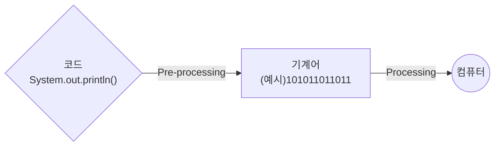
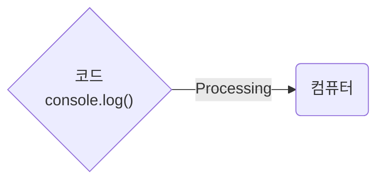

## 제목 : JavaScript 언어의 특징 - 인터프리터 언어

### 유형 : 동영상

---

## 기계가 코드를 이해하는 두 가지 방식

**공통의 목표** : 기계가 이해해야 한다.

**방법** : 개발 언어마다 처리되는 방식이 다름.

 

**Fundamental** : 개요

즉, **사람이 이해한 언어**로 작성되면,

**기계어로 번역** 되어야 한다.

 

이렇게 기계어로 번역되는 과정에는 **두 가지** 방식이 존재한다.

첫 번째로 **컴파일러 언어**, 두 번째로 **인터프리터 언어** 가 있다.

 

## 1. 컴파일러 언어

1. **사람**이 코드를 작성한다.
2. 기계어로 **변환** 한다.
3. 기계에서 **실행** 한다.

 

## 2. 인터프리터 언어

1. **사람**이 코드를 작성한다.
2. 기계에서 **실행**한다.
3. **변환**하며 진행한다.

> 이렇게 하면 조금 비효율적일 것 같다는 생각이 드는데,  
> 자바스크립트도 미리 컴파일 할 수 있는 기능이 이미 존재하지 않을까?

 

1. 컴파일 단계가 없다.
2. 컴파일러 언어에 비해, 실행 속도가 느리다. (실행하면서 컴파일을 하므로..)
3. 모던 브라우저 내부의 **V8** 엔진에서는 속도 개선이 되었다.

