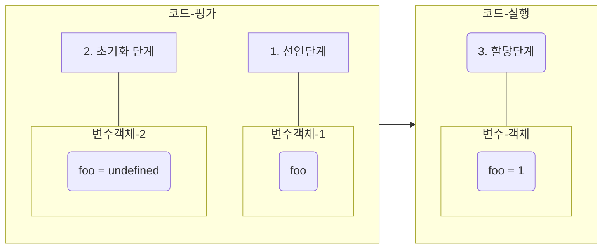

## 제목 : 변수 생성 방법과 호이스팅

### 유형 : 동영상

---

### log의 위치, 변수 키워드가 다른 것 뿐인데, 왜 결과가 다를까?

<br/>

**Example 1**

```javascript
var a;
var b = 1;
const c = 2;

console.log(a);
console.log(b);
console.log(c);
```

```text
undefined
1
2
```

<br/>

**Example 2**

```javascript
console.log(a);
console.log(b);
console.log(c);

var a;
var b = 1;
var c = 2;
```

```text
ReferenceError: Cannot access 'c' before initialization
undefined
undefined
```

<br/>

## 3 단계를 거쳐 생성되는 변수

1. 선언 단계 : Register
2. 초기화 단계 : Initialization
3. 할당 단계 : Assignment

<br/>

1. 선언 단계 : 변수를 변수 객체에 등록한다.
2. 초기화 단계 : 변수를 메모리에 할당하고, `undefined` 로 초기화한다.
3. 할당 단계 : `undefined` 로 초기화된 변수에 실제로 값을 할당한다.

<br/>

**위의 변수 생성 3단계는 키워드별로 다르게 동작한다 : (var, const, let)**

<br/>

## var 키워드

1. **코드 평가단계** : 선언과 동시에 초기화 진행
2. **코드 실행단계** : 값 할당 진행



그런데, 이미 코드 평가시점에 선언과 동시에 **초기화** 가 진행되었으므로,

**변수의 할당문이 실행되기 전에도 참조가 가능하다.**

이러한 현상을 **호이스팅** 이라고 한다.

### 호이스팅이란?

밑에 선언되어 있는 변수들이 마치,

맨 위에 선언되어 쓸 수 있는 형태로 되어있는 것을 호이스팅이라고 한다.

**호이스팅** :== 맨 위로 끌어올리다. 

```javascript
console.log(a);
console.log(b);

var a = 1;
var b = 2;
```

```text
undefined
undefined
```

<br/>

## var 키워드의 호이스팅이란? (Hoisting)

모든 선언문이 해당 **Scope** 의 선두로 옮겨진 것처럼 동작하는 특성을 지닌다.

**함수 호이스팅**, **변수 호이스팅**, 등등 

<br/>

## var 키워드의 단점

* 키워드 생략이 가능하다. : ex - `a = 1`
* 중복 선언이 가능하다.
* 변수 호이스팅의 특성을 지닌다.

이 모든것들의 단점의 특성은 하나를 가르키는데,

**변수의 결과 예측에 혼선을 준다** 라는 것이다. ==> 가독성이 현저히 떨어진다.

```javascript
a = 1; // var 키워드를 생략했다.
var a = 2; // 중복 선언이 허용되었다.
console.log(window.a); // var로 선언된 변수는, 전역변수화된다.

const b = 1;
console.log(window.b);
```

```text
2
undefined
```

