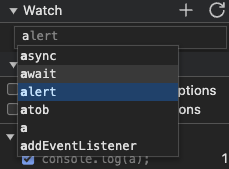
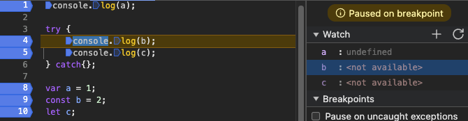

## 제목 : 변수 실습

### 유형 : 동영상

---

```javascript
console.log(a);

try {
    console.log(b);
    console.log(c);
} catch {};

var a = 1;
const b = 2;
let c;
```

위의 예제로, `var a` 의 호이스팅 작업을 살펴보며,

`b`, `c` 가 변수 생성 단계에서 머무를 시 어떤 값을 가지게 되는지에 대해서

개발자 도구의 `Sources` 탭을 사용하여 확인 할 것이다.


먼저 결과물을 보며, 이러한 형식으로 이루어진다는 것을 보여준다.

<br/>

우리가 신경써야 할 부분은 **breaking point**(브레이킹 포인트) 와 **Watch**(변수 상태 확인)

이 두 부분을 컨트롤하는 것이다.

<br/>

**breaking point** 는 왼쪽의 **코드 번호 왼쪽 부분** 을 누른다면, 해당 코드는 **브레이킹** 이 된다.

그러나, **a**, **b**, **c** 는 Watch 에서 직접 입력해 주어야 한다.



여기에서 직접 `a` 를 선택하거나, 상관없는 다른 장소를 클릭하면 자동으로 `a` 가 입력된다.


이러한 형식으로 모든 변수의 상태를 볼 수 있는 여건을 마련한다.

<br/>



`a` 는 변수 선언과 동시에 **호이스팅**(Hoisting) 되므로, 

아직 값이 할당되지 않았음에도 `undefined` 로 접근 할 수 있는 것을 볼 수 있다.

하지만, `b`, `c` 는 **실제** 코드 실행 부분에서 **초기화** 와 **할당** 이 진행되므로,

접근이 불가능하다.

위의 코드 브레이킹 포인트를 모두 진행 한 후,


**Watch** 탭에서 모든 변수가 어떠한 값이 되었는지 확인할 수 있다.

<br/>

## 변수 네이밍 컨벤션(협약)

* Camel Case : `getNumber`
* Snake Case : `get_number`
* Pascal Case : `GetNumber`
* Constant Case : `GET_NUMBER`


